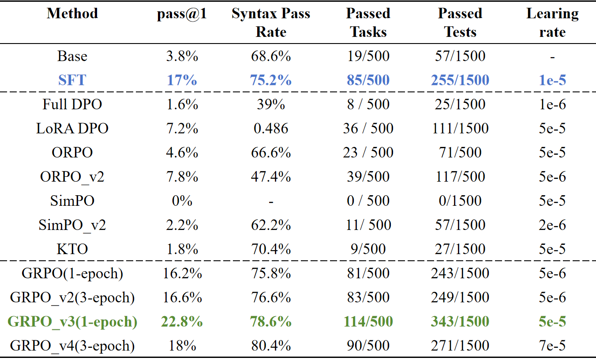
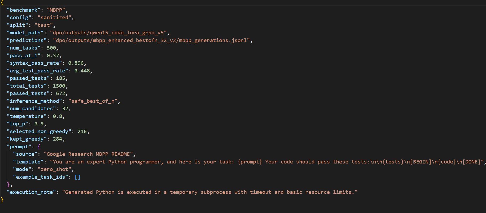
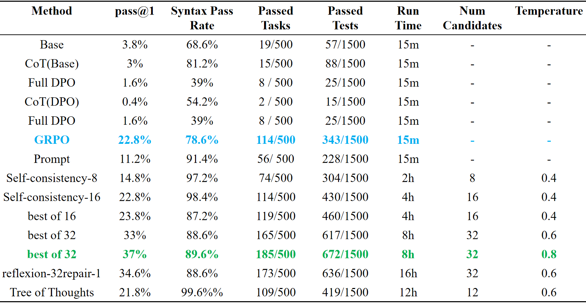

# 个人模块 README

---

## 1. 模块概览

### 1.1 模块名称

`A4 偏好对齐训练 + A5 推理增强与统一评测`

### 1.2 模块说明

本人负责的模块主要包括两部分：

- `A4`：在 SFT 模型基础上继续进行偏好对齐训练，探索 `Full DPO`、`LoRA DPO`、`SimPO`、`GRPO` 等方法对代码生成能力的提升效果。
- `A5`：在推理阶段实现 `Best-of-N`、`Self-Consistency`、`Reflexion`、`Tree of Thoughts` 等增强策略，并对生成代码进行自动执行评测。

该模块要解决的核心问题是：小参数代码模型虽然可以生成 Python 代码，但单次生成结果不稳定，容易出现语法错误、函数名不匹配、边界条件遗漏或单元测试不通过等问题。A4 通过训练阶段的偏好优化改善模型的输出倾向，A5 通过测试时增强提升最终选中答案的正确率。

从输入输出上看：

- A4 的输入是 SFT 模型目录与偏好训练数据；
- A4 的输出是对齐后的模型目录与评测结果；
- A5 的输入是待评测模型、MBPP 测试集和推理参数；
- A5 的输出是 `mbpp_metrics.json`、`mbpp_generations.jsonl`、`mbpp_cases.jsonl` 等标准化结果文件。

这两个模块共同构成了完整系统中“后期优化与验证”的关键部分，没有这一部分，团队系统只能停留在“能生成代码”，很难稳定达到“生成正确代码”的目标。

### 1.3 完成情况概览

| 类型 | 完成情况 |
|---|---|
| 基础要求 | 完成偏好对齐训练与 MBPP 自动评测流程 |
| 进阶要求 | 完成 GRPO 奖励设计、Best-of-N、Self-Consistency、Reflexion、ToT 等推理增强实验 |
| 可独立运行的演示 | `train_grpo_code.py`、`mbpp_eval_dpo_bestofn.py`、`mbpp_eval_reflexion.py`、`mbpp_eval_tot.py` |
| 与团队系统集成情况 | 接收 A2 的 SFT 模型和 A3 的偏好数据，输出训练后模型与统一评测结果供团队汇总 |

---

## 2. 环境、模型与数据依赖

### 2.1 运行环境

| 项目 | 要求 |
|---|---|
| Python 版本 | Python 3.11 |
| 必要依赖 | `torch`、`transformers`、`datasets`、`peft`、`trl`、`pandas`、`pyarrow` |
| 是否需要模型 | 需要 |
| 是否需要 GPU | 需要 |
| 是否需要外部数据集 | 需要 |

### 2.2 模型依赖

| 模型 | 来源 | 项目内相对路径 | 用途 |
|---|---|---|---|
| `Qwen1.5-0.5B-Chat` | 课程提供/公开模型 | 本地模型目录 | 基础模型 |
| `qwen15_code_full_sft` | A2 输出 | 外部 SFT 输出目录 | A4/A5 输入 |
| `qwen15_code_lora_grpo_v5` 等 | 本模块训练输出 | `dpo/outputs/...` | 推理增强评测 |

说明：

- 训练脚本中默认使用的 SFT 模型路径为：

```text
/home/wangmengxin/assignment_A/sft/outputs/qwen15_code_full_sft
```

- 评测脚本中常用的模型路径为：

```text
/home/pb/assignment_A/dpo/outputs/qwen15_code_lora_grpo_v5
```

### 2.3 数据集或样例数据依赖

| 数据或文件 | 来源 | 项目内相对路径 | 用途 |
|---|---|---|---|
| MBPP sanitized 数据集 | 课程实验数据 | `mbpp/` 对应 parquet 数据 | 代码生成评测 |
| 偏好数据 | A3 构造 | `dpo/data/code_dpo_train.json`、`code_grpo_train.json` | DPO / GRPO 训练 |
| 指标结果文件 | 本模块输出 | 各 `mbpp_*` 目录 | 实验对比与报告 |

### 2.4 安装步骤

```bash
# 1. 创建环境
conda create -n shixun-sft python=3.11 -y
conda activate shixun-sft

# 2. 安装依赖
pip install -e ./LlamaFactory --index-url https://pypi.tuna.tsinghua.edu.cn/simple
pip install jieba nltk rouge_chinese
```

---

## 3. 文件结构与接口边界

### 3.1 文件结构

```text
scripts/
├── train_grpo_code.py                    # GRPO 训练入口
├── code_grpo_rewards.py                  # 代码任务奖励函数
├── mbpp_eval_dpo.py                      # 单模型 MBPP 评测
├── mbpp_eval_lora.py                     # LoRA / 单模型评测扩展
├── mbpp_eval_dpo_simpo.py                # SimPO / DPO 类评测脚本
├── mbpp_eval_dpo_bestofn.py              # Safe Best-of-N 推理增强
├── mbpp_eval_dpo_self_consistency.py     # Self-Consistency 推理增强
├── mbpp_eval_reflexion.py                # Reflexion 推理增强
├── mbpp_eval_tot.py                      # Tree of Thoughts 推理增强
├── mbpp_eval_base/                       # Base 评测结果
├── mbpp_eval_sft/                        # SFT 评测结果
├── mbpp_eval_grpo_v3/                    # GRPO 评测结果
├── mbpp_enhanced_bestofn_32_v2/          # 最优 Best-of-N 结果
└── PERSONAL_README.md                    # 本说明文件
```

### 3.2 接口边界

| 类型 | 来源 / 去向 | 数据格式 | 说明 |
|---|---|---|---|
| 输入 | A2 输出模型 | 模型目录路径 | SFT 后模型，供 A4/A5 使用 |
| 输入 | A3 偏好数据 | JSON | `instruction/input/chosen/rejected` |
| 输入 | MBPP 测试集 | parquet / 样本记录 | 代码任务评测 |
| 输出 | A4 训练结果 | 模型目录、日志、指标 | 对齐后模型及实验记录 |
| 输出 | A5 评测结果 | JSON / JSONL | 生成结果、逐题 case、汇总指标 |

---

## 4. 基础要求实现与演示

### 4.1 基础功能说明

基础部分主要完成了两项工作：

1. 基于偏好数据对代码模型进行继续优化，并比较多种对齐方法的效果。
2. 构建统一的 MBPP 自动评测流程，对模型生成代码执行语法检查与单元测试。

### 4.2 基础功能实现路径

| 文件 / 函数 / 脚本 | 作用 |
|---|---|
| `mbpp_eval_dpo.py` | 对单个模型进行基础 MBPP 评测 |
| `mbpp_eval_lora.py` | 记录评测速度、显存和样例质量 |

基础流程：

```text
模型路径 + MBPP 数据集
-> 构造官方 MBPP Prompt
-> 生成代码
-> 提取代码块
-> ast 语法检查
-> assert 单元测试执行
-> 统计 pass@1 / syntax_pass_rate / avg_test_pass_rate
```


### 4.3 基础功能输入格式与样例

| 字段 / 输入文件 | 类型 / 格式 | 是否必需 | 说明 |
|---|---|---|---|
| `--model_path` | 路径 | 是 | 待评测模型目录 |
| `--mbpp_dir` | 路径 | 是 | MBPP 数据目录 |
| `--output_dir` | 路径 | 是 | 结果输出目录 |
| `--config` | 字符串 | 是 | `sanitized` 或 `full` |

样例：

| 样例文件 | 用途 |
|---|---|
| `mbpp_eval_base/mbpp_metrics.json` | 基础模型指标 |
| `mbpp_eval_sft/mbpp_metrics.json` | SFT 模型指标 |

### 4.4 基础功能演示命令

```bash
python mbpp_eval_dpo.py \
  --model_path /path/to/model \
  --output_dir ./mbpp_eval_result
```

运行后主要观察：

- 是否成功生成 `mbpp_metrics.json`
- 是否生成逐题 `mbpp_cases.jsonl`
- `pass@1`、`syntax_pass_rate` 是否符合预期

### 4.5 基础功能输出格式

| 输出文件 / 返回字段 | 格式 | 说明 |
|---|---|---|
| `mbpp_metrics.json` | JSON | 汇总指标 |
| `mbpp_generations.jsonl` | JSONL | 原始生成结果 |
| `mbpp_cases.jsonl` | JSONL | 逐题评测详情 |

### 4.6 基础功能结果截图



---

## 5. 进阶要求实现与演示

### 5.1 选择的进阶要求

| 进阶要求 | 是否完成 | 对应文件 / 函数 | 简要说明 |
|---|---|---|---|
| GRPO 训练与奖励设计 | 是 | `train_grpo_code.py`、`code_grpo_rewards.py` | 面向代码任务设计可执行奖励 |
| Best-of-N 推理增强 | 是 | `mbpp_eval_dpo_bestofn.py` | 多候选测试筛选 |
| Self-Consistency | 是 | `mbpp_eval_dpo_self_consistency.py` | 按执行结果分组选择 |
| Reflexion | 是 | `mbpp_eval_reflexion.py` | 失败反馈后修复 |
| Tree of Thoughts | 是 | `mbpp_eval_tot.py` | 多 thought + beam 筛选 |

### 5.2 进阶功能 1：GRPO 训练与奖励设计

#### 功能说明

GRPO 模块通过对同一题目生成多个候选答案，并依据奖励函数进行相对优化，让模型学习“什么样的代码更可能通过测试”。

#### 实现路径

| 文件 / 函数 / 脚本 | 作用 |
|---|---|
| `train_grpo_code.py` | GRPO 训练入口 |
| `code_grpo_rewards.py` | 奖励函数设计 |

流程：

```text
训练样本
-> 模型一次生成多个候选
-> 提取代码
-> 语法检查 + 函数名匹配 + 单元测试
-> 计算奖励
-> GRPO 更新模型
```

关键代码：

```python
total_reward = (
    0.10 * r_syntax
    + 0.15 * r_func
    + 0.05 * r_format
    + 0.70 * r_tests
)
```

#### 输入格式与样例

| 字段 / 输入文件 / 配置项 | 类型 / 格式 | 是否必需 | 说明 |
|---|---|---|---|
| `--train_file` | JSON | 是 | GRPO 训练数据 |
| `--model_name_or_path` | 路径 | 是 | 初始模型 |
| `--num_generations` | int | 是 | 每题候选数 |

#### 演示命令

```bash
python train_grpo_code.py \
  --model_name_or_path /path/to/sft_model \
  --train_file dpo/data/code_grpo_train.json \
  --output_dir dpo/outputs/qwen15_code_lora_grpo_v5
```

#### 输出格式

| 输出文件 / 返回字段 | 格式 | 说明 |
|---|---|---|
| 训练后模型目录 | 模型权重 | GRPO 输出模型 |
| 训练日志 | 文本/状态文件 | 训练过程记录 |

### 5.3 进阶功能 2：推理增强策略

#### 功能说明

推理增强的目标是在不继续训练模型参数的前提下，提升最终代码答案的正确率与稳定性。

#### 实现路径

| 文件 / 函数 / 脚本 | 作用 |
|---|---|
| `mbpp_eval_dpo_bestofn.py` | Safe Best-of-N |
| `mbpp_eval_dpo_self_consistency.py` | Self-Consistency |
| `mbpp_eval_reflexion.py` | Reflexion |
| `mbpp_eval_tot.py` | Tree of Thoughts |

流程：

```text
单题 Prompt
-> 生成多个候选 / 思路
-> 提取代码
-> 语法检查
-> 单元测试执行
-> 候选重排序 / 修复 / beam 保留
-> 输出最优答案
```

#### 输入格式与样例

| 字段 / 输入文件 / 配置项 | 类型 / 格式 | 是否必需 | 说明 |
|---|---|---|---|
| `--num_candidates` | int | 否 | Best-of-N / Self-Consistency 候选数 |
| `--temperature` | float | 否 | 采样温度 |
| `--repair_attempts` | int | 否 | Reflexion 修复次数 |
| `--num_thoughts` | int | 否 | ToT thought 数 |
| `--beam_width` | int | 否 | ToT 保留宽度 |

#### 演示命令

```bash
python mbpp_eval_dpo_bestofn.py \
  --model_path /path/to/model \
  --output_dir ./mbpp_bestofn_result \
  --num_candidates 32 \
  --temperature 0.8
```

```bash
python mbpp_eval_reflexion.py \
  --model_path /path/to/model \
  --output_dir ./mbpp_reflexion_result \
  --num_candidates 32 \
  --repair_attempts 1
```

```bash
python mbpp_eval_tot.py \
  --model_path /path/to/model \
  --output_dir ./mbpp_tot_result \
  --num_thoughts 6 \
  --branches_per_thought 2 \
  --beam_width 4 \
  --expand_rounds 1
```

#### 输出格式

| 输出文件 / 返回字段 | 格式 | 说明 |
|---|---|---|
| `mbpp_metrics.json` | JSON | 汇总指标 |
| `mbpp_cases.jsonl` | JSONL | 逐题结果 |
| `all_candidates_summary` | JSON 字段 | 候选详细得分 |

#### 示例图片



---

## 6. 与团队系统的集成说明

本模块在团队系统中的调用关系如下：

- A2 输出 SFT 模型目录，供 A4/A5 直接加载。
- A3 输出 `chosen / rejected` 偏好数据，供 A4 训练使用。
- A4 训练完成后输出对齐后的模型目录，例如 `qwen15_code_lora_grpo_v5`。
- A5 使用该模型目录和 MBPP 测试集运行多种推理增强实验，输出统一格式结果文件。
- 团队最终根据这些结果进行横向对比、PPT 展示与总结报告撰写。

联调中最需要注意的是：

- 模型路径必须统一；
- MBPP 数据字段在不同脚本中要兼容 `prompt/text`、`test_list/test_imports` 等差异；
- 结果文件命名要统一为 `metrics / generations / cases`，便于团队汇总。

---

## 7. 已知问题与后续改进

| 问题 | 当前原因 | 后续改进 |
|---|---|---|
| DPO/ORPO/KTO/SimPO 效果不稳定 | 小模型容量有限，偏好信号利用不足 | 调整数据质量、超参数与训练轮数 |
| 推理增强时间成本较高 | 候选数多、执行评测开销大 | 降低BATCH_SIZE、并行测试|


